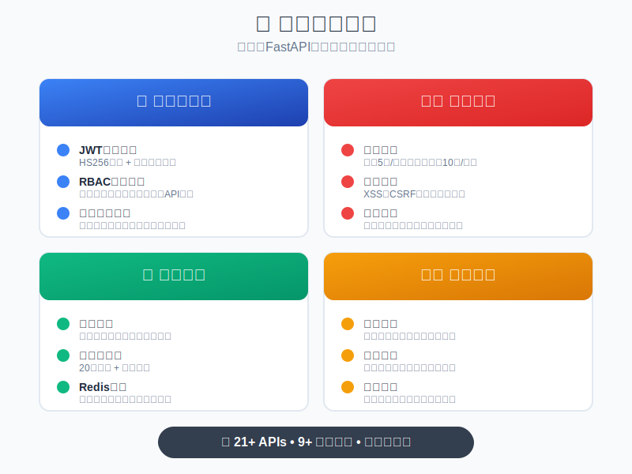

> 🚧 Still under development...

# LLM Arena

**LLM Arena** is a **strategy game battle platform powered by large language models (LLMs)**.

Previously, [PKULAB409](https://github.com/pkulab409) developed an LLM-based gaming platform for the campus network, where users could program in Python to create AI agents powered by LLMs and play the game *Avalon* ([pkudsa.avalon](https://github.com/pkulab409/pkudsa.avalon), simplified version: [python.avalon](https://github.com/pkulab409/python.avalon)).
We now plan to refactor and expand this platform to create **a richer and more complete LLM-based strategy game battle platform** — LLM Arena.

In LLM Arena, users can programmatically call LLMs to participate in strategy game battles, or join community co-creation to design and upload new strategy games to the platform.

Our goal is to popularize AI knowledge, accelerate AI applications, and explore the future possibilities of artificial intelligence.

---

[简体中文](README.md) | **English**

<!-- Star button -->

  

 

[📖 Quick Start](#-quick-start) • [🏗️ Architecture](#-architecture) • [🌐 FastAPI Docs](http://fastapi.infyai.cn/) • [🤝 Contributing](CONTRIBUTING.md) • [🌟 Star the Repo!](https://github.com/pkulab409/llm-arena)

---

## Architecture

### Backend

The backend is developed based on [FastAPI Template](https://github.com/JiayuXu0/FastAPI-Template).
[This project is licensed under MIT](docs/MIT_LICENSE_FastAPI_Backend_Template/LICENSE).

#### ✨ Key Features of FastAPI Template

### Frontend

The frontend is built with **Vue 3 + Vite + Element Plus**.
Key features include:

* 🎨 Modern UI design
* 📱 Responsive layout with mobile support
* 🔐 Full user authentication system
* 🎯 Route guards & permission control
* 🌙 Light/Dark theme support
* 📊 Data visualization & admin dashboard
* 🔄 Real-time data updates
* 📝 Form validation & error handling

---

## License

This project is licensed under the GPL-3.0 open source license.

---

## Contributing & Getting Help

* Please see our [🤝 Contributing Guidelines](CONTRIBUTING.md) to contribute to this project. Thank you!

- If you encounter issues while using this project, you can:

  * 🔍 Check existing Issues for similar problems
  * 💬 Open a new Issue describing your problem
  * 📧 Contact the maintainers

---
