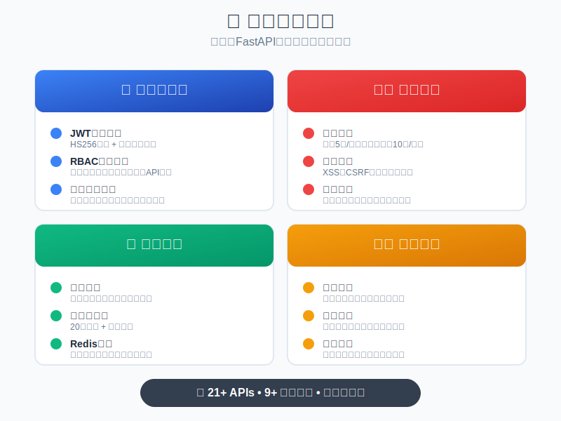

# LLM Arena

这是一个**以大语言模型为算法基础的策略游戏对战平台**。

---

<div align="center">

**简体中文** | [English](README.en.md)

<!-- 点赞区域 -->
<div align="center">
  <a href="https://github.com/pkulab409/llm-arena" target="_blank">
    
  </a>
</div>

<!-- 互动提示 -->
<p align="center">
  ⭐ <strong>喜欢这个项目？点个Star支持一下！</strong> ⭐
</p>

[📖 快速开始](#-快速开始) • [🎨 前端集成](#-前端集成) • [🏗️ 架构说明](#-架构说明) • [📚 开发指南](CLAUDE.md) • [🌐 官网文档](http://fastapi.infyai.cn/) • [🤝 贡献指南](CONTRIBUTING.md) • [🌟 给个Star!](https://github.com/pkulab409/llm-arena)

</div>

---

## 基础架构

我们基于 [FastAPI Template](https://github.com/JiayuXu0/FastAPI-Template) 开发。[该项目采用 MIT 证书](docs/MIT_LICENSE_FastAPI_Backend_Template/LICENSE)。

<div align="center">

### ✨ 核心特性


### 🛠️ 技术栈


</div>

---

## 🎨 前端集成

本项目已成功集成前端HTML界面，提供完整的全栈解决方案。

### 🚀 快速部署

```bash
# 1. 克隆项目
git clone https://github.com/pkulab409/llm-arena.git
cd llm-arena

# 2. 安装依赖
pip install -e .

# 3. 启动应用
python run.py
```

### 📱 访问地址

启动后可通过以下地址访问：

- **🌐 前端界面**: http://localhost:8000/
- **📚 API文档**: http://localhost:8000/docs
- **🔌 API端点**: http://localhost:8000/api/

### 🎯 前端功能

- ✅ **用户认证**: 登录/登出，JWT Token管理
- ✅ **用户管理**: 用户CRUD操作
- ✅ **角色管理**: 角色权限管理
- ✅ **API管理**: API列表查看
- ✅ **文件上传**: 拖拽上传，文件预览
- ✅ **响应式设计**: 适配桌面和移动设备

### 🔧 部署脚本

```bash
# Linux/macOS
./deploy.sh

# Windows
deploy.bat
```

### 🧪 集成测试

```bash
python test_integration.py
```

详细的前端集成说明请查看 [FRONTEND_INTEGRATION.md](FRONTEND_INTEGRATION.md)

---

## 🛠️ 技术栈

| 组件 | 技术选型 | 版本要求 |
|------|----------|----------|
| **语言** | Python | 3.11+ |
| **Web框架** | FastAPI | 0.100+ |
| **数据库ORM** | Tortoise ORM | 0.20+ |
| **数据库** | SQLite/PostgreSQL | - |
| **身份认证** | PyJWT | 2.8+ |
| **数据验证** | Pydantic | 2.0+ |
| **数据库迁移** | Aerich | 0.7+ |
| **包管理** | UV | latest |
| **日志** | Loguru | 0.7+ |
| **限流** | SlowAPI | 0.1.9+ |
| **缓存** | Redis | 4.5+ |

## 📁 项目结构

```
evoai-backend-template/
├── src/                          # 📦 源代码目录
│   ├── api/v1/                   # 🌐 API路由层 (轻量化路由)
│   │   ├── users/               # 👥 用户管理API
│   │   ├── roles/               # 👑 角色管理API
│   │   ├── menus/               # 📋 菜单管理API
│   │   ├── files/               # 📁 文件管理API
│   │   └── ...
│   ├── services/                 # 🔧 业务逻辑层 (核心业务)
│   │   ├── base_service.py      # 🏗️ 服务基类和权限服务
│   │   ├── user_service.py      # 👤 用户业务逻辑
│   │   ├── file_service.py      # 📄 文件业务逻辑
│   │   └── ...
│   ├── repositories/             # 🗄️ 数据访问层 (CRUD操作)
│   ├── models/                   # 📊 数据模型层
│   │   ├── admin.py             # 👨‍💼 用户角色模型
│   │   ├── base.py              # 🔷 基础模型类
│   │   └── enums.py             # 📝 枚举定义
│   ├── schemas/                  # ✅ 数据验证层
│   ├── core/                     # ⚙️ 核心功能
│   │   ├── dependency.py        # 🔗 依赖注入
│   │   ├── middlewares.py       # 🛡️ 中间件
│   │   └── init_app.py          # 🚀 应用初始化
│   ├── utils/                    # 🔧 工具函数
│   └── settings/                 # ⚙️ 配置管理
├── static/                       # 🎨 前端静态文件
│   └── index.html               # 🌐 前端HTML界面
├── migrations/                   # 📈 数据库迁移文件
├── tests/                        # 🧪 测试文件
├── uploads/                      # 📂 文件上传目录
├── logs/                         # 📋 日志文件
├── pyproject.toml               # 📦 UV项目配置
├── .env                         # 🔐 环境变量配置
├── run.py                       # 🚀 应用启动脚本
├── deploy.sh                    # 🐧 Linux部署脚本
├── deploy.bat                   # 🪟 Windows部署脚本
├── test_integration.py          # 🧪 集成测试脚本
└── CLAUDE.md                    # 🤖 Claude开发指南
```
